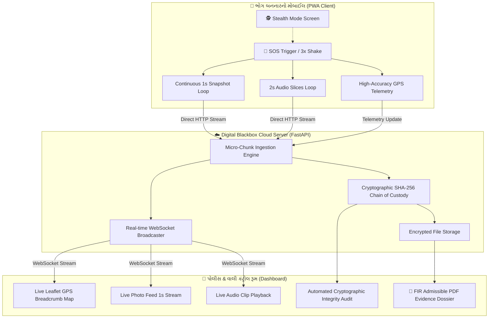

# 🛡️ Sri Sri ❤️SOS AI: Next-Gen Autonomous AI Guardian & Digital Blackbox
> **વિશ્વનું સૌપ્રથમ હાઇ-પાવર AI મલ્ટી-મોડલ SOS & પુરાવા માટેનું ક્લાઉડ ટૂલ**

---

## 📌 સમસ્યા (The Core Problem)
છેડતી, હુમલા, લૂંટ કે અકસ્માત વખતે ગુનેગાર ભોગ બનનારનો સ્માર્ટફોન છીનવી લે છે, ફોટો/વિડીયો ડિલીટ કરી નાખે છે અથવા ફોન તોડી નાખે છે. સામાન્ય SOS એપ્સ ફક્ત SMS મોકલે છે, પરંતુ કોઈ જીવંત ઓટોનોમસ AI ડિટેક્શન કે કાનૂની પુરાવો સાચવી શકતી નથી.

## 🧠 શ્રી શ્રી SOS AI: હાઇ-પાવર AI ફીચર્સ (જે આજે માર્કેટમાં ક્યાંય અસ્તિત્વમાં નથી!)
1. **👁️ Real-Time Computer Vision Suspect Profiler:** દર ૧ સેકન્ડે અપલોડ થતી ફ્રેમ પર ઓન-ધ-ફ્લાય AI ચાલે છે — શકમંદનો ચહેરો, નિકટતા (< ૧ મીટર), કપડાંનો રંગ (ડાર્ક જેકેટ, રેડ શર્ટ વગેરે), અંધારું/લાઇટિંગ ઇન્ડેક્સ અને કેમેરા જટર/ઝપાઝપી ડિટેક્ટ કરે છે.
2. **🎙️ Acoustic Forensics & Scream Peak AI:** માઇક્રોફોનમાંથી ચીસ (> ૮૫ dB), આક્રમક બૂમો, હાંફવાનો અવાજ કે ફોન પડ્યા પછીનો અકુદરતી સન્નાટો ઓળખીને રિસ્પોન્સ સ્કોર વધારે છે.
3. **🚨 Dead-Man's Cloud Snitch (Zero-Touch Breach Trigger):** જો ગુનેગાર ફોન તોડી નાખે, બેટરી કાઢી નાખે કે સ્વિચ ઓફ કરી દે, તો ક્લાઉડ સર્વર ૪ સેકન્ડમાં આપમેળે **"DEVICE DESTROYED / CRITICAL AMBUSH 🚨"** જાહેર કરીને પોલીસને હાઇ-એલર્ટ સાયરન આપે છે.
4. **🗣️ Interactive Conversational AI Voice Decoy:** નકલી કોલ દરમિયાન ફક્ત રેકોર્ડિંગ નથી વાગતું — પીડિતા ફોન પર જે પણ બોલે (દા.ત. *"પપ્પા ક્યાં પહોંચ્યા?"*), AI સામેથી વાસ્તવિક પપ્પા કે પોલીસ અધિકારી બનીને સંવાદ કરે છે (*"બેટા, હું ગલીના નાકે ગાડીમાં ઊભો છું, જલ્દી બહાર આવ"*), જેથી હુમલાખોર ડરીને ભાગી જાય.
5. **📱 AI Free-Fall & Sudden Snatch Physics Sensor:** જો કોઈ ફોન હાથમાંથી ઝૂંટવી લે કે પીડિતા નીચે પડી જાય, તો એક્સિલરોમીટર ફ્રી-ફોલ ફિઝિક્સ ગણીને સ્ક્રીન અડ્યા વગર આપમેળે SOS ચાલુ કરી દે છે.
6. **📄 Autonomous Instant Police E-FIR Generator:** કંટ્રોલ રૂમમાં એક જ ક્લિકમાં શંકાસ્પદનું AI વર્ણન, અવાજનો રિપોર્ટ, GPS મેપ અને ક્રિપ્ટોગ્રાફિક ચેઇન-ઓફ-કસ્ટડી સાથે પોલીસ માટેની કાનૂની FIR તૈયાર કરી આપે છે.
7. **🔒 Cryptographic SHA-256 Tamper-Proof Custody:** કોર્ટ-માન્ય ડિજિટલ પુરાવો જે ૧૦૦% અસલ સાબિત થાય છે.


---

## 🏗️ સિસ્ટમ આર્કિટેક્ચર (System Architecture)



---

## 🚀 પ્રોજેક્ટ કેવી રીતે રન કરવો (How to Run Live on Any Device)

### ૧. લોકલ નેટવર્ક પર રન કરો (Local Run)
```bash
python run.py
```
* **પીડિતાનો મોબાઇલ SOS:** `http://localhost:8055/` અથવા `http://<YOUR-IP>:8055/`
* **પોલીસ કંટ્રોલ રૂમ (Tactical Cockpit):** `http://localhost:8055/dashboard`
* **એડમિન પેનલ (Admin Master):** `http://localhost:8055/admin`

---

### ૨. મોબાઈલ પર કેમેરા/માઈક સાથે લાઈવ ચલાવો (HTTPS Mode)
મોબાઈલ બ્રાઉઝર્સ (Chrome / Safari) કેમેરા અને માઇક્રોફોન ફક્ત **HTTPS** પર જ પરવાનગી આપે છે. નીચેનો કમાન્ડ આપમેળે SSL સર્ટિફિકેટ બનાવીને HTTPS શરૂ કરે છે:
```bash
python run.py --https
```
તમારા મોબાઈલમાં ઓપન કરો: `https://<YOUR-LOCAL-IP>:8055/`

---

### ૩. કોઈપણ ડિવાઇસ પર ઈન્ટરનેટથી લાઈવ ખોલવા માટે (Instant Public Live Link 🌍)
જો કોઈપણ વ્યક્તિ દુનિયાના કોઈપણ ખૂણેથી પોતાના મોબાઈલ પર સિસ્ટમ વાપરવા માંગે છે (WiFi વગર):
```bash
python run.py --tunnel
```
આ કમાન્ડથી સ્ક્રીન પર **Public Live HTTPS Link** (દા.ત. `https://xxxx.loca.lt`) દેખાશે, જેને કોઈપણ મોબાઈલ, ટેબ્લેટ કે લેપટોપ પર સીધું ખોલી શકાય છે.

---

### ૪. સંપૂર્ણ સિસ્ટમ વેલિડેશન અને ટેસ્ટિંગ (Full System Verification)
```bash
python test_master_verification.py
```
(બધા ૫૮ ટેસ્ટ 100% પાસ થશે: Frontend, CSS Responsive, Cryptographic SHA-256 chain, AI Profiler, PDF, ERSS 112, CAP 1.2 Feed વગેરે).

---

## 🔑 મુખ્ય ફીચર્સ (Key Features)

| ફીચર | વર્ણન |
| :--- | :--- |
| **Micro-Chunk Streaming** | સામાન્ય વિડીયો રેકોર્ડિંગમાં જો ફોન સ્વિચ ઓફ થાય તો ફાઇલ કરપ્ટ થાય છે. આ સિસ્ટમમાં દર ૧ સેકન્ડે સ્વતંત્ર બ્લોક ક્લાઉડ પર જાય છે. |
| **Cryptographic Chaining** | દરેક બ્લોક અગાઉના બ્લોકના SHA-256 હેશ સાથે જોડાયેલો છે (`Chain_Hash = SHA256(Prev_Hash + Data_Hash + Seq)`). |
| **Stealth Mode** | હુમલાખોરને લાગે કે ફોન લોક છે તે માટે નકલી ઘડિયાળ અને બેટરી ડિસ્પ્લે સાથે સ્ક્રીન બ્લેક થઈ જાય છે, જ્યારે બેકગ્રાઉન્ડમાં કેમેરા ચાલુ રહે છે. |
| **Interactive GPS Trail** | ભોગ બનનાર જ્યાં પણ ભાગે કે તેને લઈ જવામાં આવે, તેનો લાઈવ રસ્તો (Breadcrumb polyline) મેપ પર દોરાતો રહે છે. |
| **1-Click Police Dossier** | તપાસ અધિકારી માટે એક ક્લિકમાં હેશ-પ્રમાણિત PDF રિપોર્ટ ડાઉનલોડ થાય છે જે કાનૂની પુરાવા તરીકે ઉપયોગી છે. |

---

## 📂 પ્રોજેક્ટ સ્ટ્રક્ચર (Project Structure)
```
a:\SRI SRI ❤️AI SOS\
├── backend/
│   ├── app.py                 # FastAPI Server, WebSockets, Endpoints
│   ├── evidence_manager.py    # SHA-256 Chain of Custody & Verification
│   └── pdf_generator.py       # ReportLab Police Dossier Generator
├── client/
│   ├── index.html             # Mobile SOS Blackbox PWA
│   ├── dashboard.html         # Police Tactical Live Dashboard
│   └── static/
│       ├── css/ (sos.css, dashboard.css)
│       └── js/  (sos.js, dashboard.js)
├── storage/incidents/         # Cryptographically logged cloud evidence store
├── requirements.txt           # Python dependencies
├── run.py                     # 1-Click Server Launcher
└── README.md                  # Project Documentation
```
