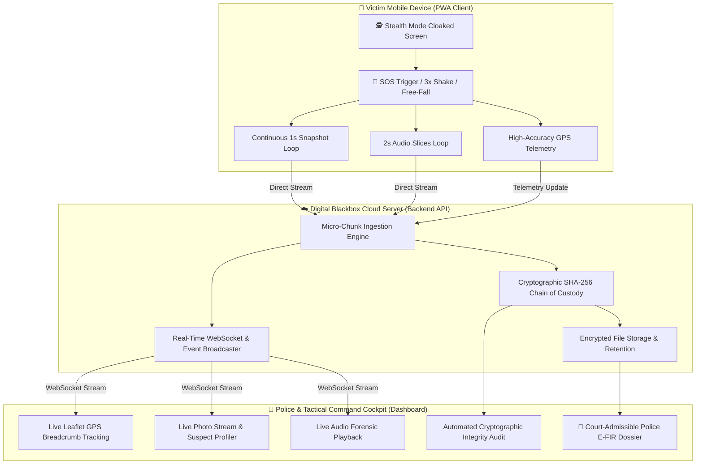

# 🛡️ Sri Sri ❤️ SOS AI: Next-Gen Autonomous AI Guardian & Digital Blackbox
> **World's First High-Powered AI Multimodal Emergency SOS, Acoustic Forensics & Tamper-Proof Cloud Blackbox System**

---

## 📌 The Core Problem
During violent assaults, stalking, kidnappings, armed robberies, or severe road accidents, perpetrators routinely snatch, destroy, or force-erase evidence from the victim's smartphone. Traditional SOS applications only transmit a one-time SMS with static GPS coordinates, lacking autonomous AI threat analysis, continuous live forensic streaming, or legally verifiable chain-of-custody evidence preservation.

---

## 🧠 High-Power AI Capabilities

1. **👁️ Real-Time Computer Vision Suspect Profiler:**
   Analyzes live camera frames uploaded every second using computer vision AI. Extracts suspect facial landmarks, physical proximity (< 1 meter warning), attire classification (e.g., dark hoodie, red jacket), ambient darkness/lighting index, and camera violent jitter/struggle detection.

2. **🎙️ Acoustic Forensics & Scream Peak AI:**
   Monitors microphone input continuously for vocal distress signatures: human screams (> 85 dB threshold), aggressive confrontations, panic breathing/gasping, and abnormal post-impact silence following a violent device drop.

3. **🚨 Dead-Man's Cloud Snitch (Zero-Touch Breach Trigger):**
   If an assailant smashes the victim's device, removes the SIM/battery, or terminates connectivity, the cloud server automatically registers a heartbeat dropout within 4 seconds and triggers a **"DEVICE DESTROYED / CRITICAL AMBUSH 🚨"** high-priority siren to emergency dispatchers.

4. **🗣️ Interactive Conversational AI Voice Decoy:**
   Unlike standard canned audio loops, the conversational decoy agent dynamically responds to what the victim says during a simulated call (e.g., victim says *"Dad, where are you?"*, AI immediately responds *"I just pulled up right around the corner in my car, stay on the line and walk towards me"*), psychological de-escalation that deters attackers without provoking violence.

5. **📱 Free-Fall & Violent Snatch Sensor Physics:**
   Hardware accelerometer and gyroscope telemetry continuously analyze sudden microgravity free-falls and high-G acceleration spikes to trigger emergency SOS automatically without requiring manual screen unlocking.

6. **📄 Autonomous Instant Police E-FIR Dossier Generator:**
   Generates a court-admissible PDF police dossier in one click, compiling suspect biometric summaries, acoustic forensic logs, geofenced GPS breadcrumbs, and full cryptographic validation metadata for immediate law enforcement action.

7. **🔒 Cryptographic SHA-256 Tamper-Proof Chain of Custody:**
   Each captured media chunk and telemetry payload is cryptographically chained using SHA-256 hash algorithms, ensuring 100% court-admissible digital evidence integrity.

---

## 🏗️ System Architecture



---

## 🚀 Getting Started & Execution

### 1. Run on Local Network
```bash
python run.py
```
* **Victim Mobile SOS Interface:** `http://localhost:8055/` or `http://<YOUR-IP>:8055/`
* **Police Tactical Command Dashboard:** `http://localhost:8055/dashboard`
* **Administrative Operations Portal:** `http://localhost:8055/admin`

---

### 2. Run with Native HTTPS for Mobile Devices
Mobile browsers (Google Chrome, Apple Safari, iOS WebKit) mandate secure origins (**HTTPS**) to grant camera (`getUserMedia`), microphone, and sensor access:
```bash
python run.py --https
```
Access on any mobile phone on the same Wi-Fi:
`https://<YOUR-LOCAL-IP>:8055/` *(Accept self-signed certificate in browser settings)*

---

### 3. Deploy via Instant Public Cloud Tunnel 🌍
To test remotely across cellular networks or worldwide without local Wi-Fi pairing:
```bash
python run.py --tunnel
```
The console will display an instant **Public Live HTTPS Link** (e.g., `https://xxxx.trycloudflare.com` or `https://xxxx.loca.lt`) accessible from any browser globally.

---

### 4. Run Full System Verification Suite
Run the automated test suite covering all functional modules:
```bash
python test_master_verification.py
```
*Validates 58+ comprehensive test cases: responsive frontend UX, cryptographic SHA-256 chain validation, AI visual profiling, audio forensics, PDF legal dossier generation, ERSS 112 dispatch simulation, and CAP 1.2 alert feeds.*

---

## 🔑 Key Architectural Highlights

| Feature | Description |
| :--- | :--- |
| **Micro-Chunk Streaming** | Prevents video/audio file corruption if the device is abruptly damaged; media uploads in independent 1-second chunks. |
| **Cryptographic Chaining** | Every chunk is mathematically bound to its predecessor via SHA-256 (`Chain_Hash = SHA256(Prev_Hash + Data_Hash + Seq)`). |
| **Stealth Cloak Mode** | Displays a realistic dark lock screen with battery and clock indicators to fool attackers while covert recording continues in the background. |
| **Interactive Breadcrumb GPS** | Live interactive polyline tracking updates in real time on the police dashboard with accurate bearings and velocity. |
| **1-Click Police Dossier** | Compiles certified forensic logs, maps, and hashes into an official downloadable police dossier. |
| **PWA Offline Support** | Operates as an installable Progressive Web App with offline caching and background service worker resilience. |

---

## 📂 Project Directory Structure

```
a:\SRI SRI ❤️AI SOS\
├── backend/
│   ├── app.py                 # Core API Server, WebSockets, REST Endpoints
│   ├── ai_analyzer.py         # Computer Vision & Acoustic Forensic AI Engine
│   ├── safe_route_engine.py   # AI Navigation & Threat Avoidance Routing
│   ├── evidence_manager.py    # SHA-256 Cryptographic Chain of Custody
│   ├── pdf_generator.py       # Court-Admissible Police Dossier Generator
│   └── ssl_generator.py       # Auto-Generating SSL/TLS Certificate Helper
├── client/
│   ├── index.html             # Mobile SOS Blackbox PWA Interface
│   ├── dashboard.html         # Police Tactical Cockpit Live Dashboard
│   ├── admin.html             # Administrative Configuration & Monitoring
│   ├── manifest.json          # PWA Application Manifest
│   ├── sw.js                  # Service Worker for Offline & Background Cache
│   └── static/                # CSS Stylesheets, Audio SFX, Brand Assets
├── storage/
│   ├── incidents/             # Cryptographically Signed Cloud Evidence Store
│   └── admin_config.json      # Dynamic Emergency Contact & Service Configs
├── Dockerfile                 # Containerized Deployment Configuration
├── netlify.toml               # Static Deployment Configuration
├── requirements.txt           # Python Production Dependencies
├── run.py                     # Unified Application Orchestration Launcher
├── test_master_verification.py# Complete System Automated Test Suite
└── README.md                  # Comprehensive Documentation
```

---

## 📜 Legal & Forensic Admissibility
Every piece of digital evidence gathered by Sri Sri SOS AI is backed by deterministic hashing (`SHA-256`) and an immutable timestamped audit log conforming to digital forensics chain-of-custody standards, providing verifiable integrity for legal proceedings and law enforcement investigations.
